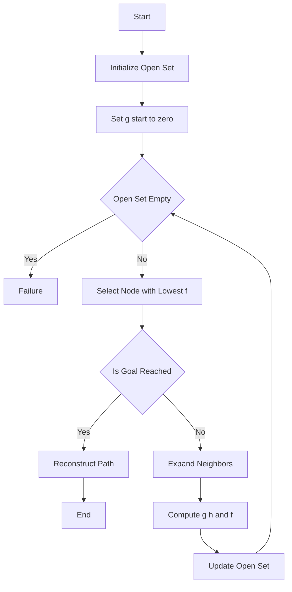
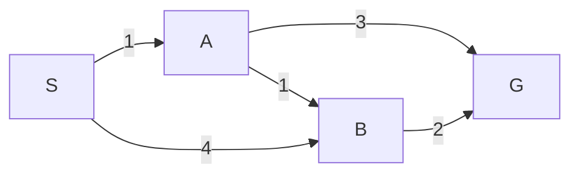

# A* Search Algorithm: Intelligent Pathfinding in AI

Search algorithms play a crucial role in Artificial Intelligence, especially in problems involving **pathfinding**, **planning**, and **navigation**. Among them, the **A\*** (A-star) search algorithm is widely used because it efficiently finds the **shortest path** while intelligently guiding the search.

This blog covers:

- Introduction to A*  
- How A* differs from Greedy Best-First and other algorithms  
- How to implement A*  
- Properties: optimality, completeness, time & space  
- Role of heuristics in optimality  
- A solved example using A*  

---

## 1. Introduction to A* Search

A* is a **best-first search algorithm** that finds the shortest path from a start node to a goal node using both:

- The **actual cost** from the start  
- A **heuristic estimate** to the goal  

It evaluates nodes using:

$$
f(n) = g(n) + h(n)
$$

Where:

- **g(n)** = cost from start to node *n*  
- **h(n)** = estimated cost from *n* to the goal  
- **f(n)** = total estimated cost  

By balancing real cost and estimated future cost, A* explores fewer nodes than uninformed algorithms like BFS or Dijkstra.

## A* Search Flowchart





---

## 2. How A* is Different from Greedy Best-First and Other Algorithms

| Algorithm | Uses g(n)? | Uses h(n)? | Optimal? | Fast? |
|----------|-----------|-----------|----------|-------|
| BFS | ❌ | ❌ | ✅ | ❌ |
| Dijkstra | ✅ | ❌ | ✅ | ❌ |
| Greedy Best-First | ❌ | ✅ | ❌ | ✅ |
| **A*** | ✅ | ✅ | ✅ | ✅ |

### Key Differences

- **Greedy Best-First Search** only uses `h(n)`  
  → Fast, but not guaranteed to find the shortest path  

- **Dijkstra’s Algorithm** only uses `g(n)`  
  → Always optimal, but explores many nodes  

- **A\*** uses both  
  → Efficient *and* optimal (with the right heuristic)

---

## 3. How to Write Code for A* Search

```python 
import heapq

def heuristic(a, b):
    # Manhattan distance
    return abs(a[0] - b[0]) + abs(a[1] - b[1])

def a_star(grid, start, goal):
    rows, cols = len(grid), len(grid[0])
    
    open_set = []
    heapq.heappush(open_set, (0, start))
    
    came_from = {}
    g_score = {start: 0}
    
    while open_set:
        _, current = heapq.heappop(open_set)
        
        if current == goal:
            # Reconstruct path
            path = []
            while current in came_from:
                path.append(current)
                current = came_from[current]
            path.append(start)
            return path[::-1]
        
        x, y = current
        neighbors = [(x+1,y), (x-1,y), (x,y+1), (x,y-1)]
        
        for nx, ny in neighbors:
            if 0 <= nx < rows and 0 <= ny < cols and grid[nx][ny] == 0:
                neighbor = (nx, ny)
                tentative_g = g_score[current] + 1
                
                if neighbor not in g_score or tentative_g < g_score[neighbor]:
                    g_score[neighbor] = tentative_g
                    f = tentative_g + heuristic(neighbor, goal)
                    heapq.heappush(open_set, (f, neighbor))
                    came_from[neighbor] = current
    
    return None

```

## 4. Properties of A*

### Optimal

A* finds the **shortest path** if the heuristic used is **admissible** (it never overestimates the true cost).

### Complete

A* is **complete**, meaning it will always find a solution if:

- A path exists  
- All step costs are positive  

### Time Complexity

In the worst case:

$$
O(b^d)
$$

Where:

- **b** = branching factor  
- **d** = depth of the optimal solution  

### Space Complexity

$$
O(b^d)
$$

A* stores all generated nodes in memory, which can be expensive for large problems.

---

## 5. Heuristics and Optimality

### What is a Heuristic?

A heuristic is a function that estimates the cost to reach the goal:

$$
h(n) \approx \text{distance to goal}
$$

It helps guide the search efficiently.

### Admissible Heuristic

A heuristic is **admissible** if:

$$
h(n) \leq h^*(n)
$$

Where:

- \( h^*(n) \) = true cost to the goal  

This guarantees **optimality**.

### Consistent Heuristic

A heuristic is **consistent** if:

$$
h(n) \leq c(n, n') + h(n')
$$

This ensures:

- No re-expansion of nodes  
- Better performance  

### Types of Heuristics

| Heuristic | Use Case |
|----------|----------|
| Manhattan Distance | Grid movement (4-direction) |
| Euclidean Distance | Continuous space |
| Diagonal Distance | 8-direction grids |
| Zero Heuristic | Turns A* into Dijkstra |

---

## 6. Example Problem Using A*

### Problem

Find the shortest path from **S** to **G**.



### Heuristic Values

| Node | h(n) |
|------|------|
| S | 5 |
| A | 3 |
| B | 2 |
| G | 0 |

### Step 1: Expanding the Start Node

From **S**, we can go to:

- **A** with cost = 1  
- **B** with cost = 4  

Calculate the evaluation function:

$$
f(A) = g(A) + h(A) = 1 + 3 = 4
$$

$$
f(B) = g(B) + h(B) = 4 + 2 = 6
$$

Since **A** has the smaller \( f(n) \), A* chooses **A** first.

---

### Step 2: Expanding Node A

From **A**, we can go to:

- **G** with additional cost = 3  

Total cost to reach **G**:

$$
g(G) = 1 + 3 = 4
$$

$$
f(G) = 4 + 0 = 4
$$

---

### Final Path

The shortest path found by A* is:

**S → A → G**

Total path cost = **4**

This is the **optimal solution**.

---

## 7. Conclusion

A* is one of the most powerful search algorithms because:

- It is **optimal**  
- It is **complete**  
- It uses **heuristics** to guide the search  
- It is efficient in practice  

With a good heuristic, A* provides both **speed** and **accuracy**, making it ideal for pathfinding and AI planning problems.
